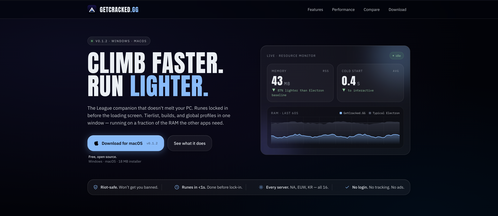
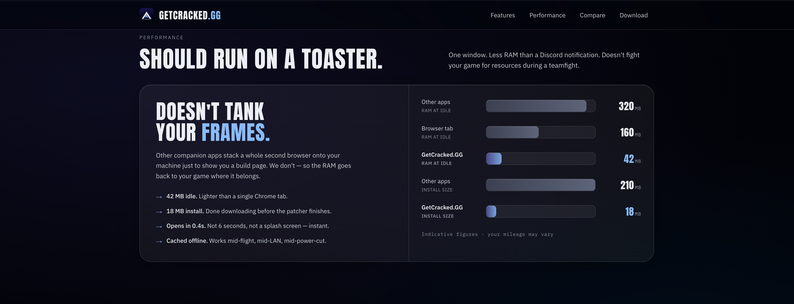
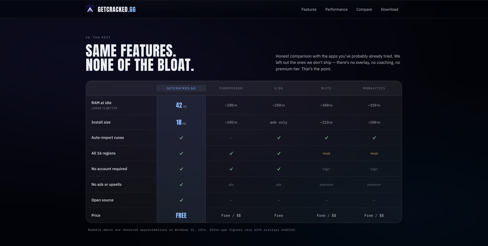

# GetCracked.GG — Landing Page

The marketing site for [GetCracked.GG](https://getcracked.gg), a fast, low-RAM League of Legends companion app for Windows and macOS.

[](https://getcracked.gg)
[](https://nextjs.org)
[](./LICENSE)



<p align="center">
  
  
</p>

---

## What this is

A small Next.js 16 marketing site. Single page: hero, trust strip, feature grid, performance benchmark, competitor comparison, download CTA, footer. No CMS, no database, no analytics.

The desktop app it advertises is a separate (currently private) Tauri project. This repo only holds the public landing page — not the app.

## What makes it interesting

- **Server-rendered, zero client JS for most of the page.** Only the platform-detected download button and the bar-chart intersection observer are client components.
- **Live downloads, live version.** The version pill and "Download for Windows / macOS" links come from a self-hosted update proxy (`https://update.getcracked.gg`) that fronts a private GitHub Releases repo. Cut a release in the app repo → the site picks up the new version on the next 5-minute revalidation. No site redeploy needed.
- **Adaptive primary CTA.** The hero's download button reads `navigator.userAgentData` / `navigator.userAgent` at hydration and swaps between "Download for Windows" and "Download for macOS". The download section always shows both Mac (Apple Silicon + Intel) and Windows so nobody has to scroll.
- **Content is data, not code.** Every section's copy + numbers live in `src/content/`. Adding a feature card, bumping a perf number, or adding a competitor column is a one-file edit — the React components only render.

## Tech stack

- **Next.js 16** (App Router, server components, Turbopack)
- **React 19**
- **Tailwind CSS v4**
- **TypeScript**
- No database, no auth, no CMS

## Getting started

Prerequisites: Node.js 20 or newer.

```bash
git clone https://github.com/RazeViana/GetCracked.GG-web.git
cd GetCracked.GG-web
npm install
npm run dev
```

The dev server runs on http://localhost:3000.

Optional — point the site at a local update proxy:

```bash
echo "UPDATE_PROXY_URL=http://localhost:8790" > .env.local
```

If `UPDATE_PROXY_URL` isn't set, the site uses `https://update.getcracked.gg`. If that's unreachable, the site falls back to friendly-slug download links (`/download/windows`, `/download/mac-arm64`, `/download/mac-intel`) and a version of `0.0.0`. The page always renders.

### Scripts

| Command         | What it does                                  |
| --------------- | --------------------------------------------- |
| `npm run dev`   | Start the dev server with Turbopack on :3000  |
| `npm run build` | Production build                              |
| `npm run start` | Serve the production build                    |
| `npm run lint`  | ESLint                                        |

## Project layout

```
src/
  app/                Next.js App Router entry (page.tsx is server-rendered)
  components/
    landing/          Page sections — Hero, Features, Comparison, etc.
    Button.tsx        Shared <Button> / <ButtonLink>
    Logo.tsx          Crest mark + wordmark
    icons.tsx         Inline SVG icon set
  content/            Editable site content — features, trust, perf, comparison
  lib/
    releases.ts       Server-side fetcher for the update proxy
    platform.ts       Browser OS detection helper
    cn.ts             classnames helper
```

## Editing content

Common edits are documented in [AGENTS.md](./AGENTS.md). The short version:

| To change…                       | Edit…                          |
| -------------------------------- | ------------------------------ |
| A feature card                   | `src/content/features.tsx`     |
| A trust pillar under the hero    | `src/content/trust.tsx`        |
| A perf-bench bar or claim        | `src/content/perf-bench.ts`    |
| The competitor comparison table  | `src/content/comparison.tsx`   |
| The displayed version            | Cut a new app release — the site picks it up automatically |

## Deployment

The site is a vanilla Next.js 16 app and deploys to any platform that supports it. The production site lives at [getcracked.gg](https://getcracked.gg).

The only runtime dependency is the update proxy at `update.getcracked.gg`. If that's reachable, the site shows the live version and links to signed download URLs. If it's not, the site renders fine with fallback links and a `0.0.0` version pill.

## License

[MIT](./LICENSE)
